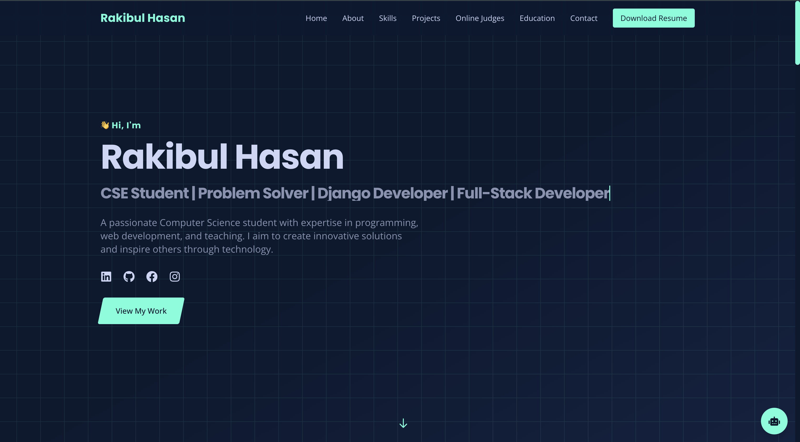

# Modern Portfolio with AI Chat Integration

A modern, responsive portfolio website built with Next.js, featuring an AI-powered chat assistant using Google's Gemini API.



## 🌟 Features

### 💻 Modern Tech Stack
- **Frontend**: Next.js 14, TypeScript, Tailwind CSS
- **AI Integration**: Google Gemini API
- **Animations**: Framer Motion
- **Icons**: React Icons
- **Styling**: Custom Tailwind theme with dark mode

### 🤖 AI Chat Assistant
- Real-time AI responses using Google Gemini
- Voice input support
- Context-aware conversations
- Smooth animations and transitions
- Error handling and fallbacks

### 📱 Portfolio Sections
- **Hero**: Eye-catching introduction
- **About**: Personal background and skills
- **Projects**: Showcase of development work
- **Skills**: Technical expertise
- **Online Judges**: Competitive programming profiles
- **Education**: Academic background
- **Contact**: Multiple contact options

### ⚡ Technical Features
- Fully responsive design
- Server-side rendering
- Optimized images
- Smooth scrolling
- Animated transitions
- Accessibility features
- SEO optimized

## 🚀 Getting Started

### Prerequisites
- Node.js 18+ installed
- Google Gemini API key

### Installation

1. Clone the repository:
```bash
git clone https://github.com/rakibul263/MyPortfolio.git
cd MyPortfolio
```

2. Install dependencies:
```bash
npm install
```

3. Create a `.env` file in the root directory:
```env
NEXT_PUBLIC_GEMINI_API_KEY=your_gemini_api_key_here
```

4. Run the development server:
```bash
npm run dev
```

5. Open [http://localhost:3000](http://localhost:3000) in your browser.

## 🛠️ Project Structure

```
portfolio/
├── app/                    # Next.js app directory
│   ├── components/         # React components
│   ├── layout.tsx         # Root layout
│   └── page.tsx           # Home page
├── public/                 # Static assets
├── styles/                 # Global styles
├── .env                    # Environment variables
└── next.config.js         # Next.js configuration
```

### Key Components
- `ChatPopup.tsx`: AI chat assistant implementation
- `OnlineJudges.tsx`: Competitive programming profiles
- `Projects.tsx`: Project showcase
- `Skills.tsx`: Technical skills display
- `Education.tsx`: Educational background
- `Contact.tsx`: Contact information

## 🎨 Customization

### Styling
- Colors can be modified in `tailwind.config.js`
- Component-specific styles in respective files
- Global styles in `globals.css`

### Content
- Update portfolio information in component files
- Modify AI chat responses in `ChatPopup.tsx`
- Add/remove sections in `page.tsx`

## 🤖 AI Chat Configuration

The chat assistant uses Google's Gemini API. Configure the behavior by modifying:
- `PORTFOLIO_INFO` in `ChatPopup.tsx` for AI context
- System prompts and response formatting
- Conversation history management

## 📱 Responsive Design

The portfolio is fully responsive with breakpoints:
- Mobile: < 640px
- Tablet: 640px - 1024px
- Desktop: > 1024px

## 🔧 Development

### Commands
```bash
npm run dev      # Start development server
npm run build    # Build for production
npm run start    # Start production server
npm run lint     # Run ESLint
```

### Adding New Features
1. Create component in `app/components`
2. Add to `page.tsx`
3. Update styles as needed
4. Test responsiveness

## 📄 License

This project is licensed under the MIT License - see the [LICENSE](LICENSE) file for details.
Copyright (c) 2024 Rakibul Hasan (rakibul263) and ragibmondal.

## 🤝 Contributing

This project was created by [Rakibul Hasan](https://github.com/rakibul263) with contributions from [Ragib Hasan](https://github.com/ragibmondal).

To contribute:
1. Fork the repository
2. Create your feature branch
3. Commit your changes
4. Push to the branch
5. Open a pull request

## 📞 Contact

Rakibul Hasan
- Email: rakibulhasanshuvo206@gmail.com
- LinkedIn: [linkedin.com/in/rakibul263](https://linkedin.com/in/rakibul263)
- GitHub: [github.com/rakibul263](https://github.com/rakibul263)

Ragib Hasan
- Email: ragib5303721@gmail.com
- LinkedIn: [linkedin.com/in/ragibhasan2](https://linkedin.com/in/ragibhasan2)
- GitHub: [github.com/ragibmondal](https://github.com/ragibmondal)

## 🙏 Acknowledgments

- Google Gemini API for AI capabilities
- Next.js team for the amazing framework
- Tailwind CSS for styling utilities
- Framer Motion for animations 